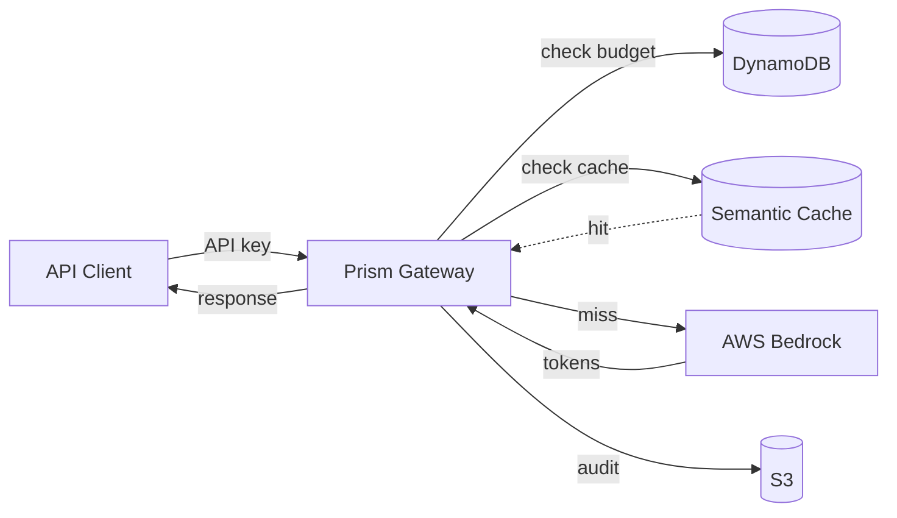

# Prism

> LLM gateway on AWS Bedrock with per-tenant budgets, semantic caching, model A/B routing, and a prompt evaluation PR gate.
> Built for $5/month, runs on $0.12/hr active. No GPU, no static credentials, no LLM hype.

[]()
[]()
[]()
[]()

---

## What It Does



1. Client sends a prompt with an API key
2. Gateway authenticates against DynamoDB, checks tenant budget and rate limit
3. Semantic cache lookup (Titan embedding + cosine similarity)
4. On miss, invoke Bedrock Claude Haiku
5. Audit the round trip to S3, increment tenant token usage
6. Return completion with cost headers (`X-Prism-Cost-Cents`, `X-Prism-Cache-Hit`)

---

## Tech Stack

| Layer | Tooling |
|---|---|
| Cloud | AWS (EKS, ECR, Bedrock, DynamoDB, S3, KMS, Secrets Manager, CloudWatch, Athena) |
| Inference | AWS Bedrock (Claude 3 Haiku, Titan Text Embeddings V2) |
| IaC | Terraform (modular, remote state) |
| Containers | Docker (multi-stage, non-root), Helm |
| CI/CD | GitHub Actions, OIDC federation |
| App | FastAPI (Python 3.12) |
| Auth | OIDC (CI), IRSA (pods), argon2 (API keys) |
| Observability | CloudWatch Container Insights, JSON logs, Athena |

No GPU. No OpenAI. No vector DB. No third-party LLM proxy. AWS-only.

---

## LLMOps Features

| Feature | Why it matters |
|---|---|
| Per-tenant API keys + token budgets | Real platforms meter and throttle |
| Semantic cache via Titan + DynamoDB | Cuts Bedrock spend 30-70% |
| Streaming (SSE) with cancellation | Modern UX, refund tokens on cancel |
| Model A/B routing | Same prompt to two models, logged for offline comparison |
| S3 audit log queryable via Athena | Spend analysis, debugging, eval dataset source |
| Cost headers on every response | `X-Prism-Cost-Cents`, `X-Prism-Tokens-In/Out`, `X-Prism-Cache-Hit` |
| Prompt eval gate on PR | PRs touching prompts must pass an eval set; regression blocks merge |

---

## Quick Start

```bash
# One-time setup (tfstate, OIDC, Budget, Bedrock model access)
make bootstrap

# Bring the stack live (~$0.12/hr + Bedrock tokens)
make up

# Try it
kubectl port-forward -n prism svc/prism-gateway 8080:80
./examples/curl/chat.sh "Explain semantic caching in one sentence."

# Tear down (back to ~$1/mo)
make down
```

**Prerequisites:** AWS CLI, Terraform >= 1.5, kubectl >= 1.28, Helm >= 3.12, Docker. Bedrock model access enabled in your AWS account.

---

## Cost Discipline

Built to run on a **$100 AWS credit** for 9-18 months.

| State | Cost |
|---|---|
| Active (gateway running) | ~$0.12/hr |
| Bedrock per 1k requests (50% cache hit) | ~$0.26 |
| At rest (destroyed) | ~$1/mo |
| Typical month (40 hrs + 5k requests) | ~$5 |

Cost guardrails:
- AWS Budgets at $10 / $25 / $50 / $75 with email alerts
- Separate budget filtered on `Amazon Bedrock` service for token tracking
- Spot t3.small node, single AZ, no NAT, no ALB at rest
- Semantic cache cuts redundant Bedrock spend
- `make down` reflex at session end
- Nightly teardown workflow as safety net

---

## Security Highlights

- **Zero static AWS credentials.** GitHub Actions uses OIDC; pods use IRSA.
- **API keys hashed (argon2).** Plaintext shown only at creation, never stored.
- **Scoped IAM.** Bedrock policies bound to specific model ARNs, not `bedrock:*`.
- **Encrypted at rest.** DynamoDB, S3 audit, Secrets Manager all use customer-managed KMS keys.
- **Audit trail.** Every Bedrock call logged to S3, partitioned by hour, Athena-queryable.
- **Hardened pods.** Non-root, read-only filesystem, capabilities dropped, seccomp default.

---

## Example Cost Query (Athena)

```sql
SELECT tenant_id,
       SUM(cost_cents)/100.0 AS cost_usd,
       SUM(tokens_in + tokens_out) AS total_tokens,
       AVG(CASE WHEN cache_hit THEN 1.0 ELSE 0.0 END) AS cache_hit_rate
FROM prism_audit
WHERE year='2026' AND month='05'
GROUP BY tenant_id
ORDER BY cost_usd DESC;
```

Result powers the cost story in interviews: "Here's actual tenant-level spend and cache effectiveness from real traffic."

---

## Repository Layout

```
prism/
├── terraform/      # VPC, EKS, ECR, IAM, DynamoDB, S3, Secrets, Budget
├── app/            # FastAPI gateway (chat, embed, tenants, audit, cache)
├── helm/           # Chart with dev and prod values
├── evals/          # Prompt regression test suite
├── examples/       # curl scripts + Python client
├── .github/        # Workflows + scripts
├── docs/           # ADRs and runbooks
├── architecture.md # Full system design, diagrams, ADRs, cost model
├── milestones.md   # 8-week implementation plan (34 issues)
└── Makefile        # Lifecycle commands
```

---

## Documentation

- **[architecture.md](./architecture.md)** — Full system design, diagrams, ADRs, cost model
- **[milestones.md](./milestones.md)** — 8-week implementation plan with all issues
- **[docs/adrs/](./docs/adrs/)** — Architecture Decision Records
- **[docs/runbooks/](./docs/runbooks/)** — Cost analysis, teardown, Bedrock region notes

---

## Status

| Milestone | Due | Status |
|---|---|---|
| 1. Foundation Infrastructure | Week 2 | Not started |
| 2. Gateway Core | Week 4 | Not started |
| 3. LLMOps Features | Week 6 | Not started |
| 4. Observability and Eval Gate | Week 8 | Not started |

---

## Related Project

**[verdict](https://github.com/abhishek-singh/verdict)** — PR-gating test execution platform on AWS EKS. Same DevOps discipline, applied to CI/CD. Together they cover full-stack platform thinking: classic DevOps (verdict) + LLMOps (prism).

---

## License

MIT
