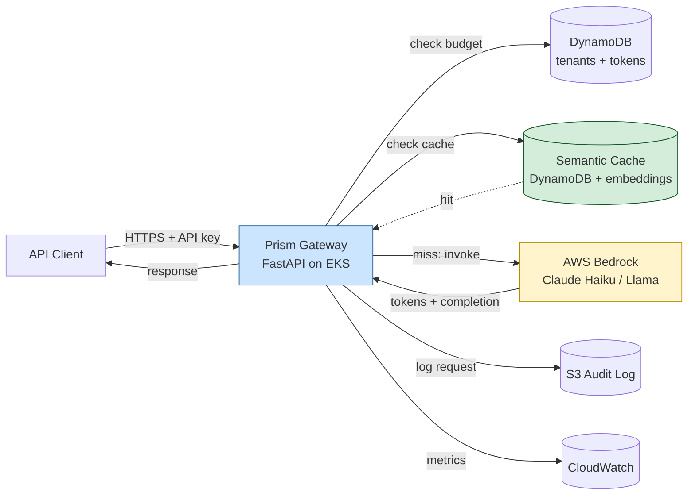
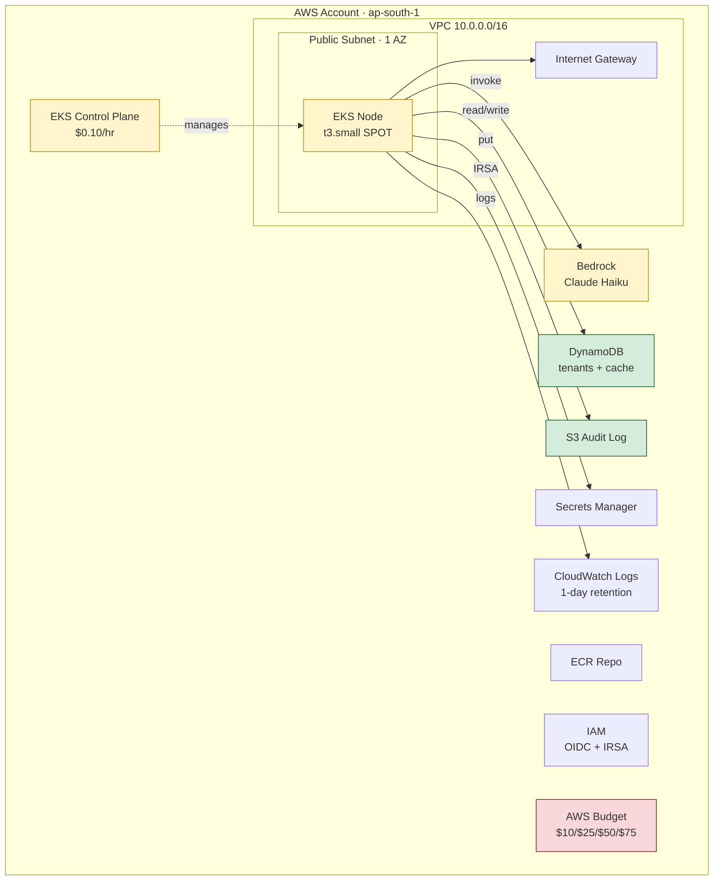
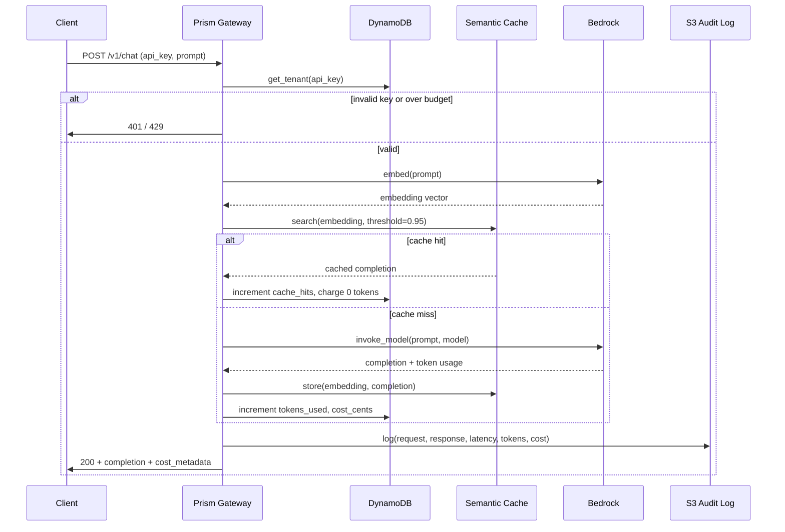
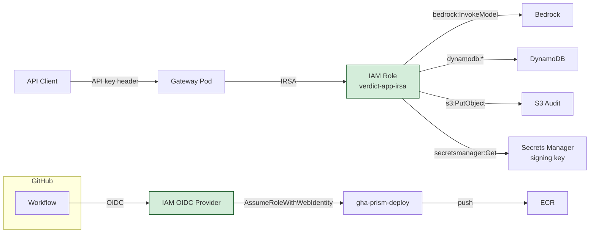
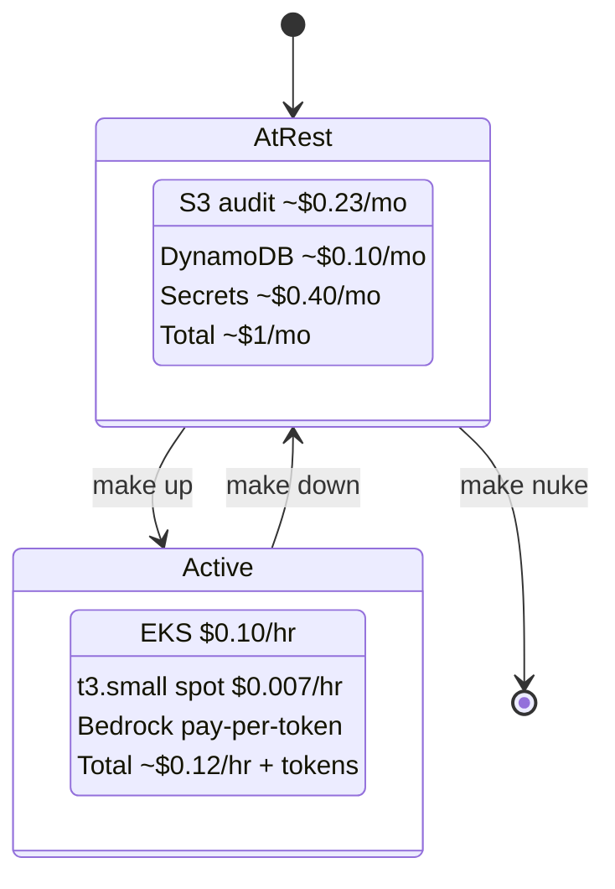

# Architecture

**Project:** prism
**Version:** 1.0.0
**Last Updated:** 2026-05-25
**Author:** Abhishek Singh

---

## Table of Contents

1. [Overview](#1-overview)
2. [Design Principles](#2-design-principles)
3. [System Architecture](#3-system-architecture)
4. [Deployment Topology](#4-deployment-topology)
5. [Request Flow](#5-request-flow)
6. [LLMOps Features](#6-llmops-features)
7. [Security Model](#7-security-model)
8. [Cost Model](#8-cost-model)
9. [Component Inventory](#9-component-inventory)
10. [Operational Lifecycle](#10-operational-lifecycle)
11. [Repository Layout](#11-repository-layout)
12. [Architecture Decision Records](#12-architecture-decision-records)

---

## 1. Overview

Prism is a cloud-native LLM gateway on AWS. It sits in front of one or more foundation models (via AWS Bedrock), adding the operator layer that bare model APIs lack: authentication, rate limiting, per-tenant token budgets, semantic caching, request/response audit logs, model A/B routing, and a prompt evaluation gate on PR.

The platform operates in two modes:

| Mode | Purpose | Footprint |
|---|---|---|
| **Dev** | Day-to-day development and demos | Single-AZ, spot, no NAT, no ALB |
| **Prod** | Documented reference for scale | Multi-AZ private, NAT, on-demand, ALB |

Only Dev is deployed. Prod exists as Terraform variables and ADRs.

**Why Bedrock, not self-hosted GPU.** GPU instances in `ap-south-1` start at ~$0.71/hr and bill while idle. Bedrock bills per token, ~$0.25 per 1M input tokens on Claude Haiku — roughly 50-100× cheaper for portfolio-scale traffic. The portfolio story is "LLMOps platform engineering," not "I bought a GPU."

---

## 2. Design Principles

| # | Principle | Rationale |
|---|---|---|
| 1 | Bedrock for inference, no GPU | Pay per token, $0 idle |
| 2 | Ephemeral by default | `make up` / `make down` lifecycle, same as Verdict |
| 3 | One AZ for dev, multi-AZ in code | Module supports both; tfvars decides |
| 4 | Public subnet, no NAT in dev | Saves $32/mo |
| 5 | Spot t3.small for the gateway pod | Gateway is I/O-bound; CPU is overkill |
| 6 | Cache aggressively | Semantic cache cuts Bedrock spend 30-70% |
| 7 | Log every request to S3 | Cheap audit trail; pulled offline for evals |
| 8 | Per-tenant token budgets | DynamoDB counter; throttle at limit |
| 9 | Budget guardrails day one | AWS Budgets at $10 / $25 / $50 / $75 |
| 10 | Anti-overclaim | No "fine-tuned," "RLHF," "private inference" unless actually done |

---

## 3. System Architecture



Client sends a prompt with an API key. Gateway checks tenant budget, checks semantic cache, falls through to Bedrock on miss, logs the round trip, returns the completion. Cache hits skip Bedrock entirely — that's where the cost savings live.

---

## 4. Deployment Topology

### 4.1 Dev Mode (Deployed)



| Color | Meaning |
|---|---|
| Green | Persistent and cheap (~$1/mo total at rest) |
| Yellow | Ephemeral or pay-per-use |
| Red | Cost or safety guardrail |

### 4.2 Bedrock Region Note

Bedrock model availability in `ap-south-1` is limited. The gateway runs in `ap-south-1`; Bedrock client calls cross-region to `us-east-1` for models not yet in Mumbai. Added latency: ~50-80ms — acceptable for portfolio demos. ADR-009 documents the choice.

### 4.3 Prod Path (Documented, Not Deployed)

Multi-AZ private subnets, NAT, ALB, VPC endpoints for Bedrock and DynamoDB, KMS-encrypted DynamoDB, S3 with object lock for audit logs. Same Terraform module, different tfvars. See Section 9.

---

## 5. Request Flow



---

## 6. LLMOps Features

The differentiators vs. a plain "FastAPI in front of Bedrock" tutorial.

| # | Feature | Why it matters |
|---|---|---|
| 1 | Per-tenant API keys with DynamoDB budgets | Real platforms meter and throttle. Demonstrates multi-tenancy. |
| 2 | Semantic cache (Titan Embed + DynamoDB) | Cuts Bedrock spend 30-70%. Direct $ impact. |
| 3 | Streaming responses (SSE) | Modern UX expectation; cancellable mid-response. |
| 4 | Model A/B routing | Same prompt to two models; logs preference. |
| 5 | Request/response audit log to S3 | Compliance, debugging, eval dataset source. |
| 6 | Prompt eval gate on PR | The Verdict pattern, applied to prompts. PRs that change prompts must pass an eval set. |
| 7 | Per-request cost in response headers | `X-Prism-Cost-Cents`, `X-Prism-Tokens-In/Out`, `X-Prism-Cache-Hit`. |
| 8 | Token rate limiting per tenant | Burst + sustained limits via DynamoDB atomic counters. |

---

## 7. Security Model



### 7.1 API Key Storage

API keys hashed with `argon2` before storage. DynamoDB stores hash + tenant ID + budget + rate limit. Plaintext key shown only at creation time. Rotation via new key issuance + grace period.

### 7.2 Trust Policy (GitHub Actions Role)

```json
{
  "Condition": {
    "StringEquals": {
      "token.actions.githubusercontent.com:aud": "sts.amazonaws.com"
    },
    "StringLike": {
      "token.actions.githubusercontent.com:sub":
        "repo:abhishek-singh/prism:*"
    }
  }
}
```

### 7.3 Pod Security Context

```yaml
securityContext:
  runAsNonRoot: true
  runAsUser: 10001
  readOnlyRootFilesystem: true
  allowPrivilegeEscalation: false
  capabilities:
    drop: ["ALL"]
  seccompProfile:
    type: RuntimeDefault
```

### 7.4 Defense in Depth

| Layer | Control |
|---|---|
| Identity | OIDC federation, IRSA, hashed API keys |
| Authorization | Least-privilege IAM, per-tenant scope |
| Network | Private EKS endpoint option, scoped SGs |
| Workload | Non-root, read-only FS, dropped capabilities |
| Supply chain | ECR scan-on-push, immutable tags |
| Secrets | Secrets Manager + customer-managed KMS |
| Audit | All requests logged to S3, CloudTrail enabled |
| Abuse | Rate limits + token budgets per tenant |

---

## 8. Cost Model

### 8.1 Active Cost (per hour, gateway running)

| Resource | Hourly |
|---|---|
| EKS control plane | $0.100 |
| 1x t3.small spot | $0.007 |
| CloudWatch logs | $0.010 |
| Data transfer | $0.005 |
| **Gateway total** | **~$0.122/hr** |

### 8.2 Bedrock Cost (per usage, Claude 3 Haiku)

| Operation | Rate | Example |
|---|---|---|
| Input tokens | $0.00025 per 1k | 1k requests at 500 input tokens = $0.125 |
| Output tokens | $0.00125 per 1k | 1k requests at 300 output tokens = $0.375 |
| Titan Embed | $0.00002 per 1k | 1k cache lookups = $0.01 |
| **Per 1k requests** | | **~$0.51** |

With 50% cache hit rate: ~$0.26 per 1k requests.

### 8.3 At-Rest Cost (per month, gateway destroyed)

| Resource | Cost |
|---|---|
| S3 audit log (10 GB) | $0.23 |
| DynamoDB on-demand (low) | $0.10 |
| Secrets Manager | $0.40 |
| ECR images | $0.10 |
| **Total** | **~$0.85/mo** |

### 8.4 Budget Runway on $100 Credit

| Usage Pattern | Monthly | Months Runway |
|---|---|---|
| 40 hrs active + 10k Bedrock requests | ~$10 | ~10 |
| 20 hrs active + 5k requests | ~$5 | ~20 |
| Demo only: 5 hrs + 1k requests | ~$1.50 | ~65 |

### 8.5 Cost Lifecycle



---

## 9. Component Inventory

### 9.1 Infrastructure (Terraform)

| Component | Dev | Prod | Module |
|---|---|---|---|
| VPC | 1 AZ, public | 2 AZ, public + private | `modules/vpc` |
| NAT Gateway | OFF | ON | `modules/vpc` |
| EKS Cluster | 1 managed nodegroup | 1 managed nodegroup | `modules/eks` |
| Node Group | 1x t3.small SPOT | 2x t3.medium on-demand | `modules/eks` |
| ALB | OFF | ON | ALB Controller via Helm |
| ECR | 1 repo, scan-on-push | same | `modules/ecr` |
| DynamoDB tables | tenants, cache, requests | same + global tables | `modules/dynamodb` |
| S3 audit bucket | versioned, KMS-encrypted | + Object Lock | `modules/s3` |
| Bedrock model access | Claude Haiku, Titan Embed | + Llama, Claude Sonnet | model access config |
| IAM | OIDC + GHA + IRSA | same | `modules/iam` |
| Secrets Manager | API signing key + CMK | same | `modules/secrets` |
| AWS Budgets | 4 thresholds | same | `modules/budget` |
| VPC Endpoints (Bedrock, DDB, S3) | OFF | ON | `modules/vpc` |

### 9.2 Application

| Component | Notes |
|---|---|
| FastAPI gateway | `/v1/chat`, `/v1/embed`, `/v1/tenants`, `/health` |
| Dockerfile | Multi-stage, slim base, non-root UID 10001 |
| Helm chart | Single chart; `values-dev.yaml` + `values-prod.yaml` |
| Eval harness | `evals/` directory; PR-runnable prompt regression suite |

### 9.3 CI/CD Workflows

| Workflow | Trigger | Purpose |
|---|---|---|
| `prompt-eval-gate.yml` | PR touching `prompts/` or `evals/` | Run eval set, block merge on regression |
| `deploy-infrastructure.yml` | PR (plan), merge (apply) | Terraform lifecycle |
| `build-push-image.yml` | Reusable | Docker + ECR |
| `nightly-teardown.yml` | Cron 23:00 IST | Cost insurance |

---

## 10. Operational Lifecycle

```
make bootstrap    # one-time: tfstate, OIDC, Budget, Bedrock model access
make up           # apply infra + helm install gateway
make demo         # port-forward 8080, run curl scripts in examples/
make eval         # run eval harness locally
make down         # destroy ephemeral resources
make nuke         # destroy bootstrap (archive only)
make cost         # current month spend + token spend breakdown
```

End-of-session reflex: `make down`.

---

## 11. Repository Layout

```
prism/
├── Makefile
├── README.md
├── architecture.md
├── milestones.md
├── AGENTS.md
├── docs/
│   ├── adrs/
│   └── runbooks/
├── terraform/
│   ├── bootstrap/
│   ├── modules/
│   │   ├── vpc/
│   │   ├── eks/
│   │   ├── ecr/
│   │   ├── iam/
│   │   ├── dynamodb/
│   │   ├── s3/
│   │   ├── secrets/
│   │   ├── bedrock/
│   │   └── budget/
│   └── environments/
│       ├── dev/
│       └── prod/
├── app/
│   ├── main.py
│   ├── routers/
│   │   ├── chat.py
│   │   ├── embed.py
│   │   └── tenants.py
│   ├── core/
│   │   ├── bedrock.py
│   │   ├── cache.py
│   │   ├── budget.py
│   │   ├── auth.py
│   │   └── audit.py
│   ├── Dockerfile
│   ├── requirements.txt
│   └── tests/
├── helm/
│   └── prism-gateway/
├── evals/
│   ├── prompts/
│   ├── datasets/
│   └── runner.py
├── examples/
│   ├── curl/
│   └── python-client/
└── .github/
    ├── workflows/
    └── scripts/
```

---

## 12. Architecture Decision Records

| ADR | Decision | Cost Impact |
|---|---|---|
| 001 | Bedrock over self-hosted GPU | Pay-per-token, $0 idle vs $0.71/hr |
| 002 | EKS over Lambda for gateway | Streaming + long-poll patterns easier on EKS |
| 003 | OIDC + IRSA, no static credentials | $0 |
| 004 | DynamoDB over RDS for tenants/cache | Serverless, near-free at portfolio scale |
| 005 | Semantic cache via Titan Embed | Bedrock-native, no extra service |
| 006 | S3 audit log over CloudWatch retention | Cheaper at scale, queryable via Athena |
| 007 | Per-tenant API keys hashed with argon2 | Industry standard, no plaintext at rest |
| 008 | Prompt eval gate on PR | LLMOps equivalent of test-gate; differentiator |
| 009 | Bedrock cross-region from ap-south-1 to us-east-1 | Model availability; +50ms acceptable |
| 010 | Nightly teardown workflow | Caps blast radius |

Full ADRs in `docs/adrs/`.

---

*Version controlled alongside the codebase. Update when architecture changes.*
